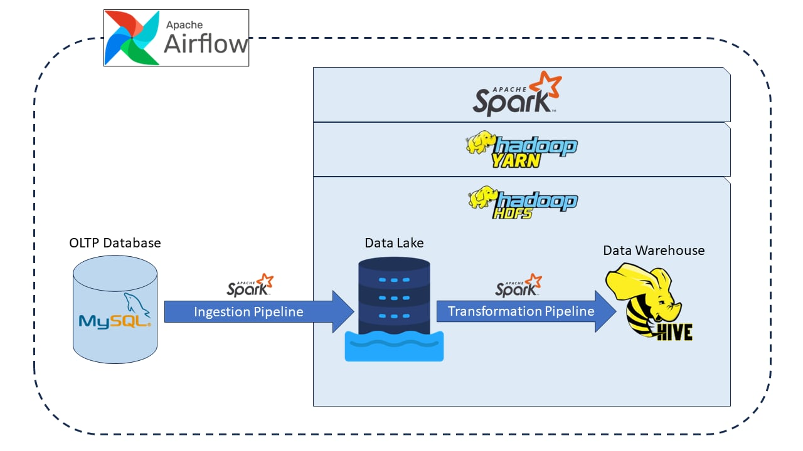

# Data Engineering Project | Synthetic Retail Data


## Overview

This project consists of two main pipelines for data processing and management using a combination of **MySQL, Hadoop HDFS, Apache Hive, Apache Spark, and Apache Airflow**. The pipelines are designed to incrementally ingest data from an OLTP database into a data lake and transform the data for storage in a data warehouse.

## Pipelines

### 1. Ingestion Pipeline

The ingestion pipeline is responsible for extracting data from an OLTP MySQL database and saving it to a data lake in HDFS. The data is stored in Parquet format, partitioned by `year`, `month`, and `day`. There is no transformation of data during this process.

**Key Components:**
- **Source:** OLTP Database (MySQL)
- **Destination:** Data Lake (Hadoop HDFS)
- **Format:** Parquet
- **Partitioning:** `year`, `month`, `day`
- **Tools:** Apache Spark, Apache Airflow

### 2. Transformation Pipeline

The transformation pipeline extracts data from the data lake, applies transformations to fit a new schema, and saves the transformed data to a data warehouse (Hive). The data warehouse runs on top of the same Hadoop HDFS as the data lake.

**Key Components:**
- **Source:** Data Lake (Hadoop HDFS)
- **Destination:** Data Warehouse (Hive on HDFS)
- **Tools:** Apache Spark, Apache Airflow

## Technology Stack

- **OLTP Database:** MySQL
- **Data Lake:** Hadoop HDFS
- **Data Warehouse:** Hive (on HDFS)
- **ETL Engine:** Apache Spark (running on YARN)
- **Orchestration Tool:** Apache Airflow

## Project Structure

The project directory is structured as follows:
```bash
.
├── dags # Airflow DAGs
├── notebooks # jupyter notebook experiments
├── requirements.txt
├── sample_data # example data for Retail OLTP Database
├── scripts
│   ├── 01_load_database_table_from_csv.py # script to load csv file as table into OLTP Database
│   ├── 02_create_retail_db_schema.py # script to create OLTP Database Schema
│   ├── 03_generate_multiple_date_sales_data_with_load.py # script to create synthetic sales data for OLTP Database
│   └── common_used_bash_commands.txt
├── setup.py
└── src
    ├── generator # module for generating synthetic data
    │   ├── generator.py
    │   ├── load_table_from_csv.py
    │   └── schema.py
    ├── pipelines
    │   ├── ingestion_fixed_table.py # ingest table that stable overtime
    │   ├── ingestion.py
    │   ├── transformation.py
    │   └── utils.py
    └── utils
        ├── db_connection.py # helper module for connecting with MySQL Database, this module need MySQL credentials saved in .env file to operate
```

## Setup and Execution

### Prerequisites

- MySQL server
- Hadoop and HDFS set up with YARN
- Apache Hive installed on HDFS (with MySQL database as MetaStore)
- Apache Spark installed and configured to run on YARN
- Apache Airflow installed (with MySQL database as metadata storage)
